# duplicat_env

Pick a road on a map, press Generate, and get a copy of that place for CARLA, Autoware and RoadRunner.

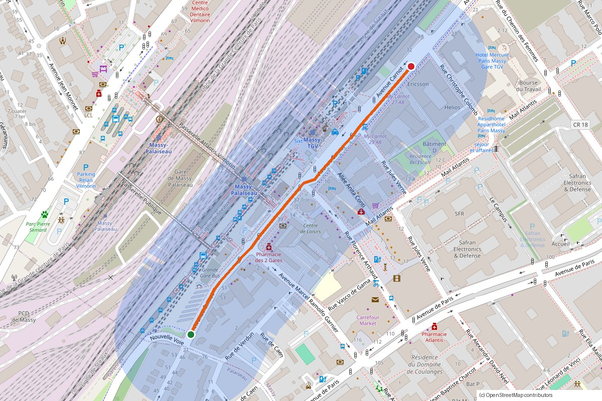

That's the first test route: 550 m of Avenue Carnot past the two Massy stations, with a 120 m corridor on each side. It builds in about 30 s once the data is cached.

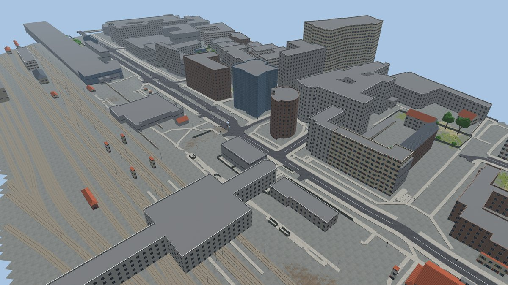
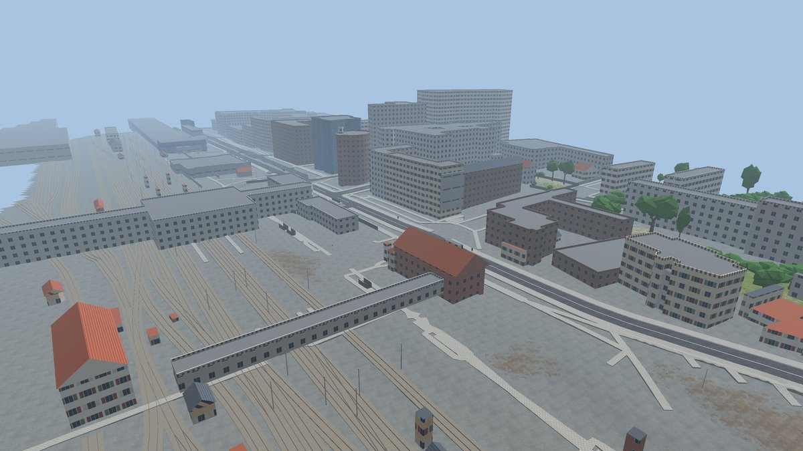

The same scene after RoadRunner built its own roads and junctions on top of it:

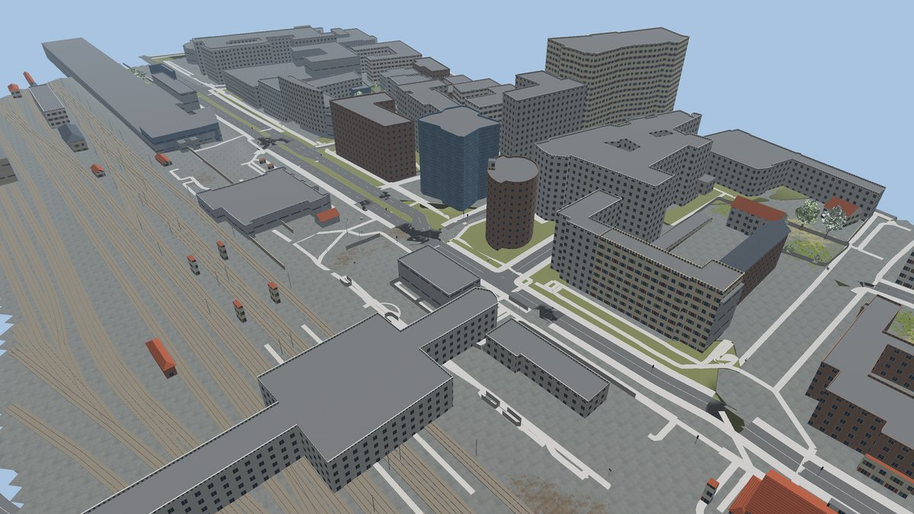

The second test is 5.7 km of the A10 near Briis-sous-Forges. Here the 2,854 trees come from the IGN lidar, each at its real place and height, and every patch of ground has its own texture (meadow, crops, ploughed field, forest floor, lawn):

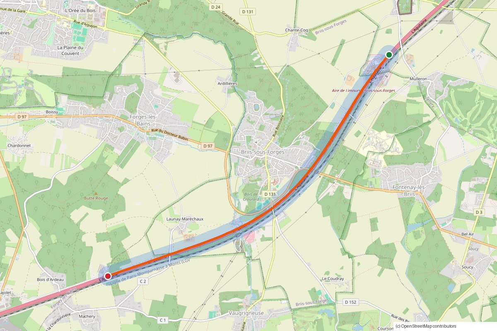
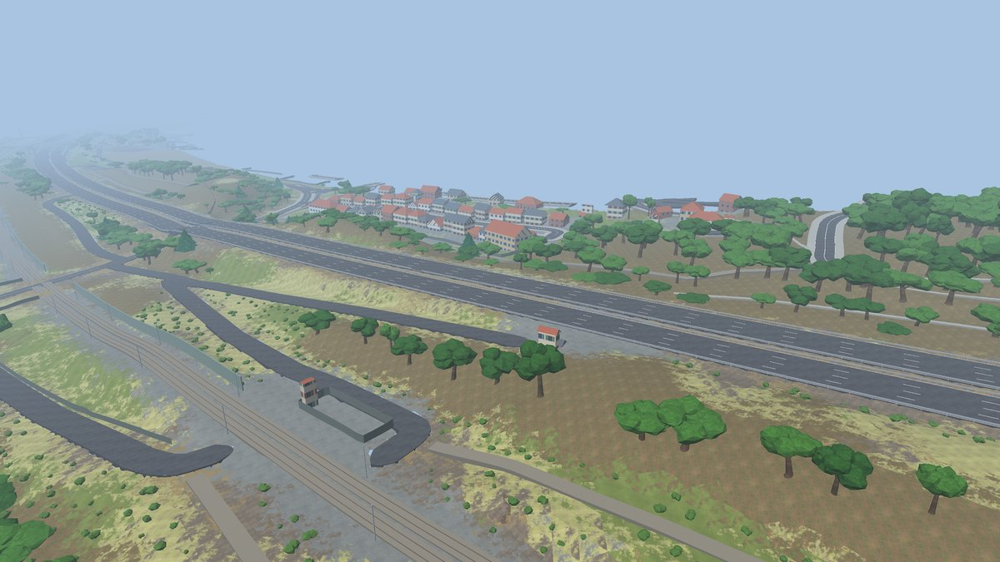
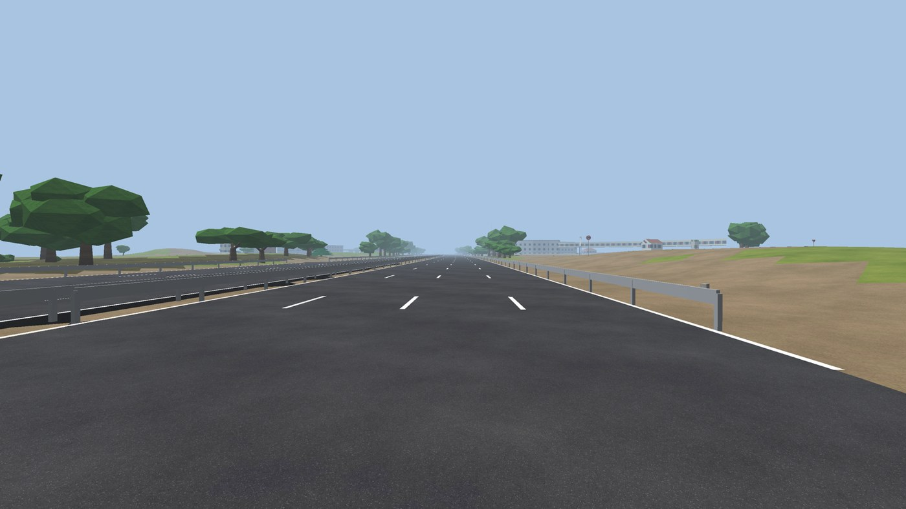

The pictures come from `tools/render_preview.py`, which renders the generated files offscreen on the GPU. They are not mockups.

## What you get

For a route called `<name>`, `output/<name>/` holds:

| Folder | What it is | Used by |
|---|---|---|
| `carla/<name>/` | `<name>.fbx` (the 3D environment), `<name>.xodr` (road network), `<name>.json`, `textures/` | CARLA `make import` |
| `autoware/<name>/` | `lanelet2_map.osm`, `pointcloud_map.pcd`, `map_projector_info.yaml` | Autoware `map_path` |
| `roadrunner_project/` | a RoadRunner project with the scene `Scenes/<name>.rrscene`, plus RoadRunner's own exports in `Exports/` (CARLA FBX + xodr with junctions, Lanelet2, OpenDRIVE) | RoadRunner, to edit the scene by hand |
| `osm/` | the OpenStreetMap data of the corridor | JOSM, netconvert |
| `preview/` | `<name>.glb` plus `map.png`, `aerial.png`, `street.png` and the RoadRunner versions | browser viewer, Blender, this README |

Everything uses one local frame. A point (x, y) in the xodr is (x, y) in the lanelet map and (x, -y) in Unreal, which is how CARLA and the Autoware bridge already map them.

## Start

```bash
cd ~/duplicat_env
./run.sh          # opens http://127.0.0.1:8777 (next free port if taken)
```

Search a place, click the start, any waypoints and the destination along the road, and press Generate. The page shows the log, the download links and a 3D preview when it's done.

In "Follow roads" mode the route always follows real roads, never a straight line between your clicks. Each leg is routed several ways (OSRM on two servers and Valhalla, with and without a driving-direction hint) and the page keeps the candidate without U-turns or backtracking. On a motorway, a click on the carriageway going the other way used to make a detour through the next interchange (a 3 km leg became 39 km). Now the direction hint snaps it to your side. Arrows on the map show the driving direction. If a detour remains, the page says which leg to fix. If no router can route a leg, you get an error, not a straight line. Freehand mode is still there for drawing straight segments on purpose.

The third mode, Area, builds a whole zone instead of a road. Click around it: the shape always closes back to point 1 (the closing edge is dashed while you draw), and the page shows the outline length and the area. Everything inside gets built: every road with its junctions, the buildings, trees and ground. The polygon replaces the corridor. OSM is fetched with Overpass `poly:` queries in 3 km pieces, or cut from the Geofabrik extract. After the download, the pipeline picks the main road inside the area (highest road class, longest piece) for the spawn point and the route checks, and writes it to `route.geojson`. The polygon itself goes to `area.geojson`.

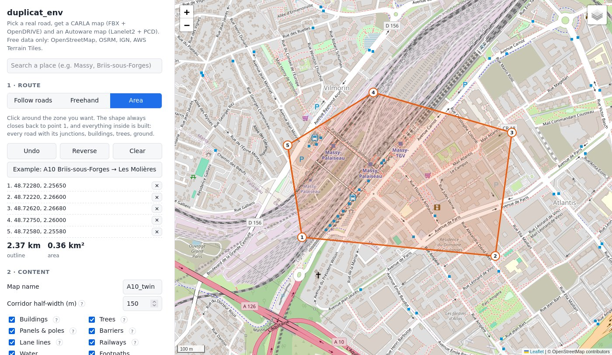

The same zone built, on the map and in RoadRunner:

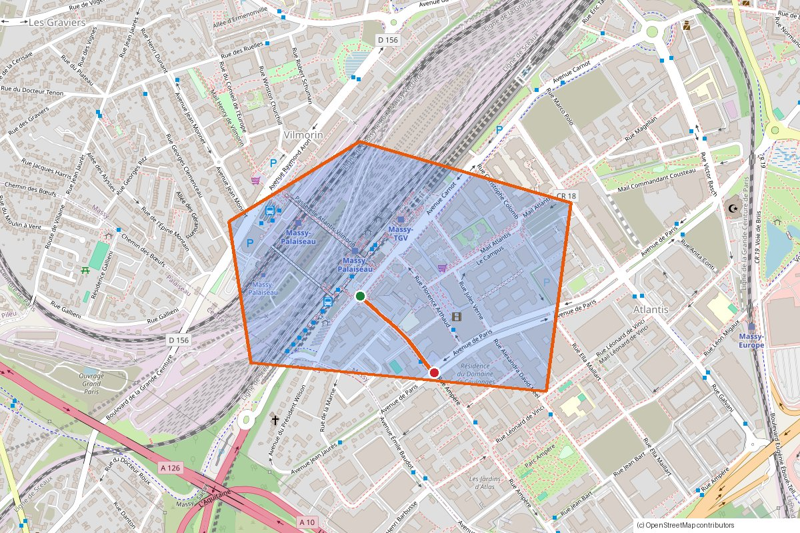
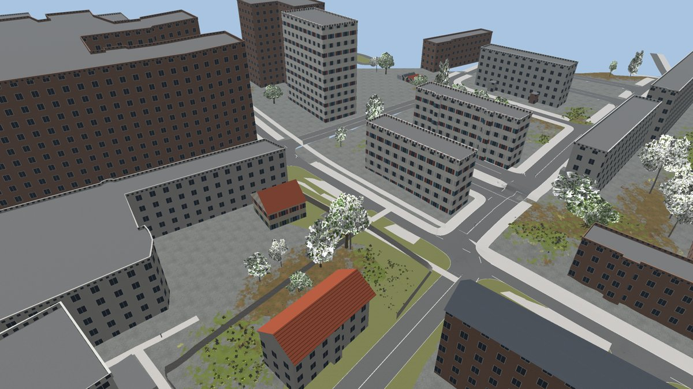

A 0.36 km² zone around the Massy stations (742 roads, 96 junctions) takes about 30 s without RoadRunner. Above 25 km² the page warns that it will take long.

Without the page:

```bash
python3 cli.py --waypoints "48.7230,2.2587;48.7268,2.2634" --name Massy_Gare --set corridor=120
python3 cli.py --geojson my_route.geojson --name A10_x --set roadrunner_project=~/RoadRunner/MyProject
python3 cli.py --area my_zone.geojson --name Massy_zone          # a GeoJSON Polygon: everything inside it
```

## The page, option by option

Every option with a `?` next to it opens a short explanation with an example picture, taken from this section.

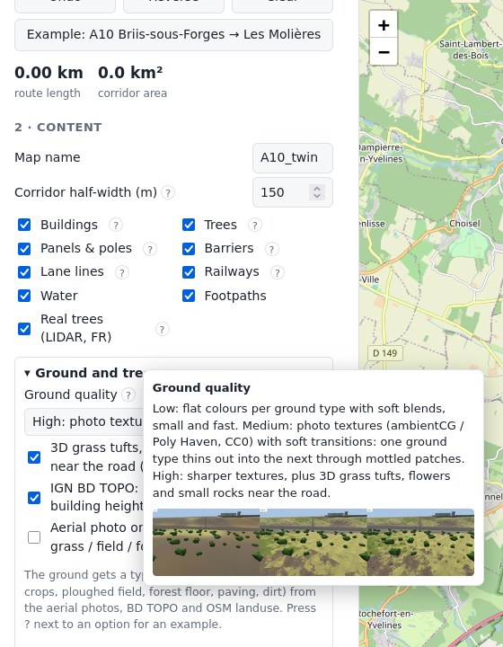

### Route

"Follow roads" snaps your clicks to the road network; "Freehand" draws straight segments; "Area" draws a closed zone and builds everything inside it (the corridor width is not used then). Undo, Reverse (drive the other way) and Clear work on the points. The route length and corridor area update as you click.

### Corridor half-width

Everything within this distance of the route gets built. 150 m covers what a car's cameras and LiDAR see. The map shows the corridor as a band:


### Buildings

Footprints from OSM, heights from OSM or BD TOPO, and BD TOPO buildings that OSM lacks. The style follows the building type, and houses get pitched roofs:


### Trees and real trees (LIDAR)

With "Real trees" on (France), every tree over 3 m is placed from the IGN LIDAR canopy model with its measured height and crown. Without it, trees come from OSM woods and tree rows:


### Panels and poles

Signs from OSM with a drawn face, gantries, advance exit panels, lamps, power poles:


### Barriers, inferred guard rails and lane lines

OSM walls, fences and noise barriers; guard rails along roads of 90 km/h and more (they stop at every exit); lane lines from the OpenDRIVE road marks:

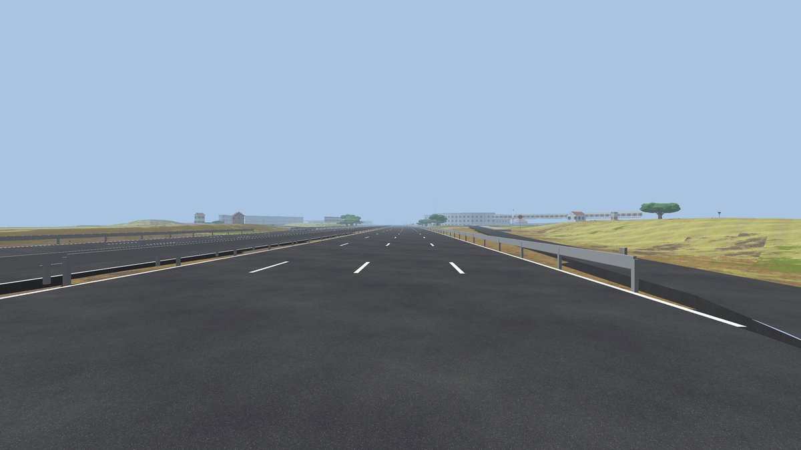

### Railways, water and footpaths

Tracks with ballast and catenary poles, water surfaces, and footpaths merged into the pavements.

### Ground quality and 3D details

Low, medium or high, described under "What the generated FBX contains". The pictures there show the three levels side by side and the grass tufts along a verge.

### Aerial photo on the ground

Drapes the IGN photo on the terrain instead of the ground textures.

### Road network

"Junctions by CARLA's converter" builds every intersection, exit and roundabout. "RoadRunner only" skips CARLA; you then draw the junctions in RoadRunner. "Simple" is the old model without junctions.

### OSM source, elevation source, terrain grid, tree settings, country rules

Leave them on their defaults unless you have a reason. The OSM source "Auto" uses Overpass and, on long routes, races it against the Geofabrik extract.

### Autoware outputs

The point cloud map (density and voxel size), lanelets for side roads, and the 3D preview file.

### RoadRunner

Builds the RoadRunner project, with every building as its own prop you can move:


"Also export from RoadRunner" asks RoadRunner for its own CARLA FBX, Lanelet2 and OpenDRIVE (about 4 min on a 50 km route). "Existing project" puts the scene in one of your projects instead of copying the 2 GB asset library again.

### Build

Each step gets its own bar and clock with a detail line, and the PC's RAM shows underneath:

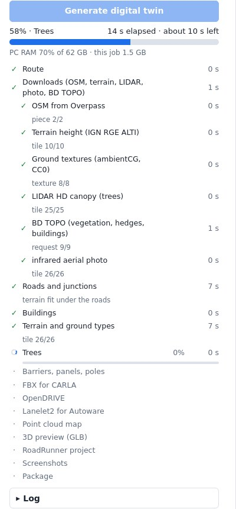

## Data sources

No API key and nothing to pay.

| What | Source |
|---|---|
| Roads, lanes, speed limits, buildings, trees, barriers, signs, poles, rail | OpenStreetMap through Overpass, or a Geofabrik regional extract downloaded once and read locally (used when Overpass is overloaded, and raced against it on long routes) |
| Routing between your clicks | public OSRM servers and Valhalla (FOSSGIS) |
| Elevation | IGN RGE ALTI in France (1 to 2 m), AWS Terrain Tiles elsewhere (10 to 30 m) |
| Trees | IGN LIDAR HD canopy height model (1 m, France), OSM woods and trees elsewhere |
| Ground type (lawn, meadow, crops, field, forest floor, paving, dirt) | IGN colour and infrared aerial photos, IGN BD TOPO vegetation zones, OSM landuse |
| Ground textures (medium and high quality) | [ambientCG](https://ambientcg.com) and [Poly Haven](https://polyhaven.com), both CC0 (public domain). Downloaded once into `cache/textures/`: about 90 MB for medium, 300 MB for high |
| Building heights, missing buildings, forest leaf type, hedges | IGN BD TOPO (France) |
| Aerial photo on the ground (optional) | IGN BD ORTHO, France only |

Google Maps can't be used: its terms forbid extracting the data, and the API needs a key and billing.

## RoadRunner project

If RoadRunner is installed (found automatically under `/usr/local/RoadRunner_R20*`, or set `ROADRUNNER_BIN`), each build also starts RoadRunner without a window and drives it through its API:

1. creates the project (or opens the one you give in `roadrunner_project`)
2. writes a RoadRunner HD Map file with the props and footpaths (the roads come from the OpenDRIVE, step 5)
3. places library assets where RoadRunner has a good one: Beech, Ash, Elm, Maple, Birch and Zelkova trees, Coulter pines, bushes, guard rails, jersey barriers and fences. Speed limit, stop, give way, no entry and danger signs use the closest German sign
4. adds everything else as exact-size props: the textured ground, grass tufts and rocks, railway, lamps, poles, walls, and the French panels with their text. Every building is its own prop (`Building_<OSM id>`), so you can select one, move it, turn it or delete it. The ground is cut out under every road, so only RoadRunner's road shows there, without our mesh or texture over it
5. imports the generated OpenDRIVE first, so RoadRunner shows exactly the roads and junctions CARLA gets, then the HD Map with the props on top, and saves `Scenes/<name>.rrscene`
6. exports a CARLA package, Lanelet2 and OpenDRIVE from RoadRunner into `Exports/`

Open `roadrunner_project/` in RoadRunner to change anything, then export to CARLA from the RoadRunner menu. That gives you two CARLA versions to choose from. The generated FBX in `carla/` matches the Autoware maps exactly. The RoadRunner one has proper junction geometry and nicer assets.

A new RoadRunner project copies the whole asset library (about 2 GB). To avoid that on every run, fill "Existing project" in the page (or `--set roadrunner_project=...`). The scene and its props then go into that project under `Assets/duplicat_env/<name>/`.

The HD Map import needs the RoadRunner Scene Builder add-on, which your license has.

## Road network with real junctions

The OpenDRIVE file is a real road network, the way OSM describes it. CARLA's own OSM converter (`carla.Osm2Odr`, SUMO netconvert inside, already in your CARLA install) builds it: every intersection, motorway exit, slip road and roundabout entry becomes an OpenDRIVE junction, with lane connections that follow the one-way rules. The generator then:

- cuts the OSM roads on the corridor border itself (a new node where the road leaves the corridor), so long motorway segments are kept up to the edge
- splits every road longer than 1 km (`max_road_len`) at a geometry boundary and rewires the links and junction references, so no single road runs for kilometres. The pieces meet exactly, in height too: RoadRunner refuses to export a scene with roads "not aligned" at a joint, and a height step there is a bump for the car
- gives every road a real elevation profile (the converter output is flat), with heights averaged where roads meet, so no step appears at a junction. That includes service roads (the converter types them "restricted") and sidewalk-only pieces: they used to stay at height 0 and showed up under the ground in RoadRunner, with walls down to them. Traffic lights get their height from their road too; the converter writes them at 0 and RoadRunner uses that
- builds a surface for those service roads and sidewalks as well, so driveways and car park lanes are in the CARLA scene
- keeps a car lane on roads with a bus lane. OSM often gives `lanes=1` with `busway:right=lane`, and the converter then turned the only lane into a bus lane: cars could not drive the road in CARLA or Autoware (Avenue Marcel Ramolfo Garnier at Massy was one)
- adds traffic lights where OSM has `highway=traffic_signals`. On long routes the converter's traffic light step can crash (segfault), so it runs in a separate process, and when it crashes the network is built again without traffic lights instead of stopping the job
- opens to cars the `highway=service` roads the selected route drives on (car park loops, toll area lanes). The converter's SUMO type map closes every service road to cars, which cut the route wherever the router used one

The road mesh, the terrain fit, the guard rails and the Lanelet2 map are all built from that same OpenDRIVE. The car in CARLA and the Autoware planner use the same lanes, and RoadRunner imports the same file.

In the Lanelet2 map, neighbouring lanes going the same way share their boundary line, so Autoware can change lanes over dashed lines (it needs that to reach an exit). Lanes are joined wherever the OpenDRIVE links them, even when the converter left their corners a metre or two apart. Stub lanes under 3 m, which the converter sometimes draws backwards inside a junction, are skipped and their neighbours linked directly.

The road mesh is merged per level and per 250 m block: all lanes and junctions of one level become one surface, and pavements and footpaths another, with the asphalt cut out of them. No two road surfaces lie on top of each other, so there's no flicker between two roads or between a road and its junction. `tools/check_overlaps.py` measures it: 1 overlapping triangle out of 41,712 at Massy, 170 out of 181,136 (0.09%, at bridge ends) on the A10.

Guard rails run along roads of 90 km/h and more, and stop at every junction, so exits and slip roads stay open.

On the A10 test: 1,001 roads, 181 junctions, longest road 990 m, and a car drives 5.9 km (the whole route and a little past its end) through 21 roads and 8 junctions. The Lanelet2 map (1,499 lanelets) routes from the start of the selected route to its end across all of them.

A longer test is a 56 km loop on the A10 out to the Saint-Arnoult toll and back (6,013 roads, 847 junctions, 7,225 lanelets, built in under 9 minutes from an empty download cache, with under 3 GB of RAM). Every 10 m of the route lies on a lane reachable from the start, in the OpenDRIVE and in Lanelet2.

## What the generated FBX contains

Roads: the OpenDRIVE network above, with lane lines from its road marks (France 3 m dash / 10 m gap), pavements with a curb, bridges with an underside and piers every 30 m. Footpaths from OSM join the pavement surface. Tracks keep their own strip.

Terrain: a 4 m grid flattened under the roads and blended back into the elevation model. Terrain never rises above the asphalt (checked on 60,156 road points of the A10 test). Each 4 m cell gets a ground type: lawn, meadow, crops or stubble, ploughed field, forest floor, paving or dirt. The colour aerial photo decides what is green, the infrared one what grows (it is often from another season, when verges look dry), and BD TOPO and OSM landuse say where the forests, farms and towns are.

Where two ground types meet, the border follows noisy, organic shapes, and the mesh is refined there to 2 m (medium) or 1 m (high) triangles. Between the two photo textures, a band of mixed textures makes one type thin out into the other through patches, like grass getting sparse at the edge of a dirt track:

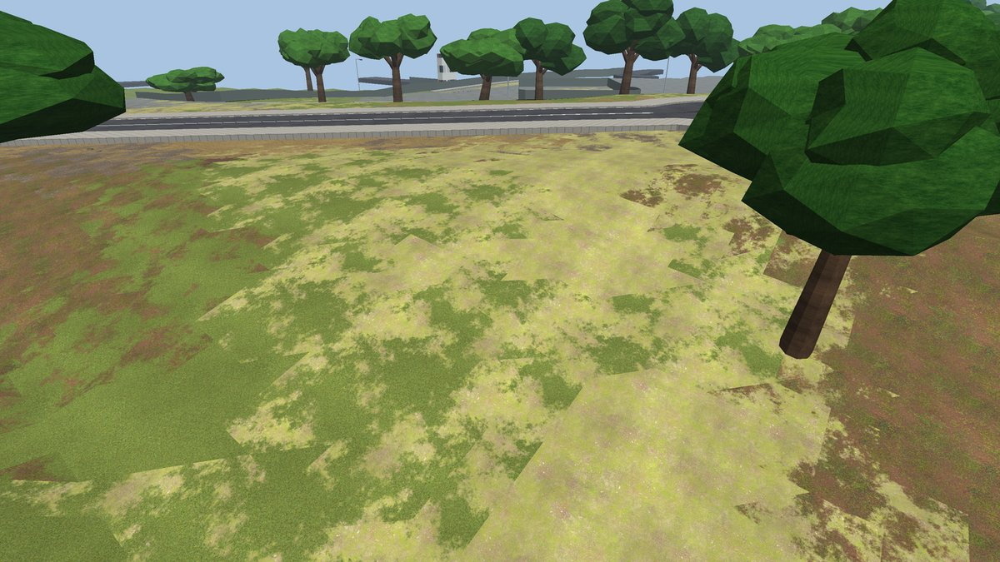

Ground quality has three levels (page option, or `ground_quality`):

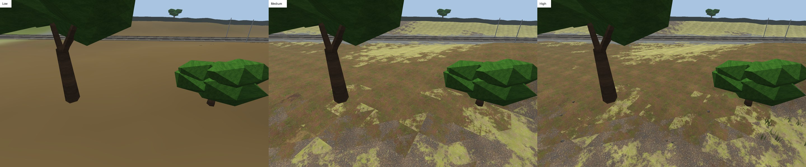

- low: flat colours with soft blends, one small baked texture per 500 m tile. No download, 4 MB of textures on the 5.7 km Briis route
- medium: photo textures at 1K, soft transitions. 27 MB of textures on that route
- high, the default: photo textures at 2K, composed into 4K textures with shifted copies mixed together so the pattern doesn't repeat, plus 3D details near the road: grass tufts of 16 blades in mixed heights on lawns and meadows (some knee-high, a few with white, yellow and purple flowers), small half-buried rocks on dirt and forest floor. About 100 MB of textures and 2.5 M extra triangles (`detail_tri_budget`) on that route. In the RoadRunner project, part of the grass spots also get RoadRunner's own small plants (up to 4,000)

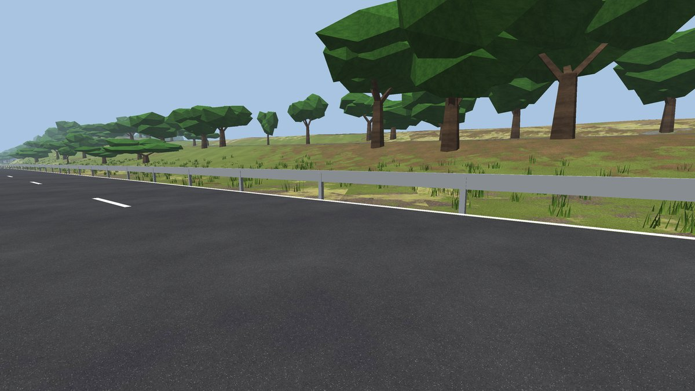

The aerial photo can still be draped on the ground instead (option in the page). It looks right from above and blurry from the road:

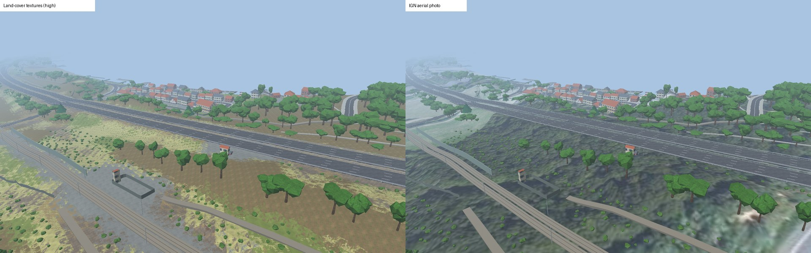

Buildings: heights from OSM, or from BD TOPO when OSM has none, and buildings missing from OSM are added from BD TOPO. Each building gets a style from its type: houses in cream, white or ochre render with coloured shutters, stone or red brick; apartments in render, concrete or brown brick; offices in glass or concrete; industrial buildings in grey, blue or beige metal cladding. Houses, farms and churches get gabled or hipped roofs with an overhang, in red tiles or slate (metal on farm buildings). Flat roofs on apartments and offices get a parapet. Choices are stable: the same building looks the same on every run.

Textures: the ground uses CC0 photo textures at medium and high quality (Grass004, Ground037, Ground104, Ground048, Gravel043, Ground023 and Rock030 from ambientCG, brown_mud_leaves_01 from Poly Haven). Everything else is generated and tileable: asphalt, bark, leaves, roof tiles, slate, metal, 12 facade styles. If a texture download fails, the generated version of that ground type is used.

Trees: in France every tree taller than 3 m comes from the IGN LIDAR HD canopy height model: position, height and crown width are measured, not guessed. The generator takes the local peaks of the canopy, drops those on buildings, roads or non-green pixels (lamp posts, trucks), and spaces them by crown size. Leaf type comes from BD TOPO (broadleaf, conifer, mixed), or from the infrared photo where BD TOPO has no answer (conifers are darker in infrared). BD TOPO hedges become rows of bushes. Outside France, OSM woods, tree rows and single trees are used. Small trees and bushes are kept off the asphalt, so a car never hits a crown on the road. Trees nearest the road get a detailed model: a tapered trunk with a root flare, 5 to 7 branches with twigs and 11 lumpy leaf clusters in two shades for a broadleaf (about 1,100 triangles), 9 to 12 drooping jagged tiers for a conifer (300), five clumps for a bush (400). They share a 3 M triangle budget (`hq_tri_budget`), given to the closest trees first, within 60 m of a road (`hq_tree_m`). Farther trees use the light models (about 170, 75 and 40 triangles), so every lidar tree stays. The RoadRunner project places RoadRunner's detailed library trees at exactly the same spots.

Around the road: buildings extruded from their footprints, guard rails, walls, noise barriers, fences, hedges, lamps, power poles and towers, gantries, billboards, cameras, milestones, emergency phones, toll booths, railway with ballast and catenary poles, and water. Panels come from OSM `traffic_sign` tags with a drawn face (speed limit number, stop, give way, danger, direction, town name), turned towards the traffic they're meant for. Exit panels are added at motorway exits.

Guard rails and advance exit panels are rarely in OSM, so by default they are inferred along motorway and trunk edges, with gaps wherever a slip road leaves. You can turn that off.

CARLA rules the generator follows:
- mesh names follow the import convention (`Road_Road_*`, `Road_Marking_*`, `Road_Sidewalk_*`, `Terrain_*`)
- nothing is named with "sign" or "light", because CARLA's cooking step deletes those meshes without a warning (panels are called `Panel_*`)
- the xodr carries lane speeds and speed-limit signals, so the Traffic Manager follows the limits. CARLA only has sign models from 30 to 120 km/h, so on 130 km/h stretches set the speed with `tm.set_desired_speed`.

## Speed and progress

The page shows every step with its own bar, its time, and a detail line such as "tile 45/119" or "piece 7/19". Steps that give no progress (CARLA's converter, RoadRunner) show a moving bar and a running clock. The heading shows the total time and an estimate of the time left, and a line under it shows the PC's RAM use and the job's own. The generator sends an update at least every 2 s, so a frozen job shows up as "no update for ...". Reloading the page, or opening it in a second tab, picks up the running job.

What runs in parallel:

- all downloads start together: OSM, IGN terrain height, LIDAR canopy, infrared photo and BD TOPO. Each server gets a fixed number of connections (6 for IGN, 2 per Overpass server), because more gets refused
- Overpass pieces go to four servers at once, and a busy server is skipped straight away
- on routes over 8 km, Overpass races the Geofabrik extract (a one-time 340 MB download for Ile-de-France, then about 90 s to read); the first one done is used
- terrain tiles and LIDAR tree detection use one thread per core, up to half the RAM (20 on a 24-core PC). The result is the same as with one thread: the FBX is identical
- the RoadRunner project builds while the FBX, point cloud and preview are written

IGN sometimes answers "layer unknown" for a layer it has, and more often under load. Those requests are retried now. Before, each one lost a tile: 47 of 119 LIDAR tiles in one test, which left whole stretches without trees.

Measured on the 56 km A10 loop with nothing in the download cache: 29 min before, under 9 min now. Downloads went from about 22 min to under 3 min, and terrain from 22 s to 2 s. With the cache filled (the same route again), it takes about 2 min without RoadRunner at high ground quality. On a route that long, RoadRunner sets the pace: about 7 min, most of it in its own CARLA export. Untick "Also export from RoadRunner" (`rr_exports`) when you only want the project to edit; you can export from RoadRunner yourself afterwards.

## After generating

```bash
tools/install_to_carla.sh output/<name>                 # copy to ~/carla/Import and run make import
python3 tools/carla_drive.py output/<name>              # ego car, 64-channel LiDAR, traffic
python3 tools/render_preview.py output/<name>           # redo the screenshots
```

For Autoware, use `output/<name>/autoware/<name>` as `map_path`.

Checks that don't need Unreal:

```bash
python3 tools/validate_xodr.py output/<name>/carla/<name>/<name>.xodr      # drives from the spawn through the junctions
python3 tools/check_overlaps.py output/<name>                               # overlapping road surfaces
python3 tools/check_road_heights.py output/<name>/carla/<name>/<name>.xodr  # roads or traffic lights at height 0, steps at links (works on RoadRunner's exported xodr too)
source /opt/ros/humble/setup.bash && python3 tools/validate_lanelet2.py output/<name>/autoware/<name>/lanelet2_map.osm   # follows the route every 10 m
python3 tools/carla_xodr_world.py output/<name>        # road-only world in a running CARLA
```

On the Massy route, CARLA's parser loads the network (213 roads, 59 junctions) and a car drives 690 m through 10 junctions. On the A10 it drives 5.9 km through 8 junctions. Both Lanelet2 maps load in the Lanelet2 library with 0 errors and route from the start of the selected route to its end.

## Limits

The copy is as good as the open data. Roads, signs and panels come from OSM, so signs nobody mapped are missing. The lidar and BD TOPO parts only work in France. Elsewhere trees and ground types fall back to OSM. Ground types are read from 2 m aerial photos, so a narrow strip of grass can be missed. The smooth transitions are baked into textures and mesh, not done by a blending shader, so up close you can still spot where a mixed patch starts. Pitched roofs are built over the footprint's bounding rectangle, so only near-rectangular buildings get one; L-shaped and complex buildings keep a flat roof.

Memory: every job started from the page runs in its own process with a hard ceiling of 90% of your RAM and no swap. Before that ceiling, the job watches the whole PC: when 80% of the RAM is in use (CARLA, Autoware and everything else counted), new downloads and tiles wait until usage drops back to 72%, and the page shows it in red. Change the threshold with `ram_high` (0.80 by default). Trees are capped by triangles (`veg_tri_budget`, 2.5 M by default), and the tree count adapts. On the 56 km A10 loop the generator peaks at 3.4 GB at high ground quality, and the FBX is 1.5 GB (1.0 GB at low). The fine transition mesh stays within 30 m of a road (`ground_fine_m`), where a car sees it; farther away the borders use the 4 m grid. The preview is limited to 4 M triangles, and RoadRunner's OBJ preview is skipped above 3 M triangles or 300 library trees (RoadRunner writes every library tree in full in an OBJ, which gave 6.5 GB for the A10 test).

Keep routes under about 16 km across. Unreal Engine 4 loses float precision far from the origin and its world ends around 20 km. 5 to 10 km works best.

The junction network needs the `carla` Python module (it is in your CARLA 0.9.15 install). Without it, the generator falls back to the older road model, where side roads have no junctions. The log says which one was used.

Library props in RoadRunner are stretched to the box they're given. Trees get the height and crown width from the generator, which looks right. Lamps and poles stay as generated meshes because their library versions would be distorted.

Not tested on this machine yet: `make import` into Unreal of either FBX, and `ue_semantic_tags.py`, which moves imported meshes into CARLA's semantic folders. Plain LiDAR sees every mesh anyway. That script only matters for semantic LiDAR and the segmentation camera.

## Layout

```
server.py, web/          page (Leaflet map, three.js viewer)
cli.py                   same pipeline from the command line
dupenv/                  pipeline: routing, osmdata, osm_pbf, elevation, landcover, groundtex, roads, features, materials, meshlib, textures, progress
dupenv/roadrunner.py     headless RoadRunner driver
dupenv/writers/          fbx, xodr, lanelet2, pcd, glb, rrhd (RoadRunner HD Map)
tools/                   CARLA / Autoware / RoadRunner helpers, validators, renderer (render_same_view.py compares outputs from one camera)
docs/                    screenshots used above
cache/                   downloaded tiles, OSM data, compiled RoadRunner protos (created at run time, not in the repo)
output/<name>/           results (created at run time, not in the repo)
```

## Copyright and contact

duplicat_env was designed and built by Adnane Yacheur. Copyright (c) 2026 Adnane Yacheur, all rights reserved; see [LICENSE](LICENSE).

For questions, collaboration or permission to reuse the code, write to adnaneyacheur@gmail.com.

Data credits: map data (c) OpenStreetMap contributors (ODbL); elevation, LIDAR HD, aerial photos and BD TOPO from IGN (Licence Ouverte / Etalab 2.0); ground textures from ambientCG and Poly Haven (CC0). The generated maps are not in this repository: run the generator to build them.

